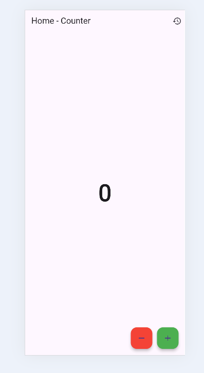
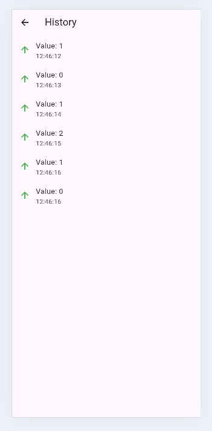

# simple_app

Aplikasi Flutter sederhana untuk mempelajari **stateful widget** dan **state management (Provider)**.  
Tema aplikasi: **Counter dengan History**  
Pengguna dapat menambah angka di halaman utama, lalu melihat riwayat perubahan angka di halaman history.

---
## 🎯 Tujuan
- Memahami perbedaan Stateless vs Stateful widget.  
- Menerapkan state management (`Provider`) untuk mengubah UI secara reaktif.  
- Membuat widget tree yang rapi, terstruktur, dan mudah dibaca.  

---
## 📂 Struktur Folder

lib/
├── main.dart # Entry point aplikasi
├── models/
│ └── history.dart # Model untuk menyimpan data history
├── providers/
│ └── counter_provider.dart # State management dengan ChangeNotifier
├── screens/
│ ├── home_screen.dart # Tampilan utama (counter)
│ └── history_screen.dart # Tampilan daftar history
└── widgets/
└── history_item.dart # Widget untuk menampilkan 1 item history

---
**Penjelasan:**
- `models/` → berisi data model (`History`).  
- `providers/` → state management (`CounterProvider`).  
- `screens/` → halaman utama & halaman history.  
- `widgets/` → widget custom (`HistoryItem`).  

---
## Widget Tree
MaterialApp
 └── HomeScreen
     ├── Text (counter value)
     ├── ElevatedButton (to HistoryScreen)
     └── FloatingActionButton (+)

HistoryScreen
 └── ListView → HistoryItem (angka + waktu)

---
## State Management
- Aplikasi ini memakai Provider.
- CounterProvider → menyimpan angka counter & daftar history.
- increment() → menambah angka dan menyimpan history baru.
- notifyListeners() → memberi tahu widget agar UI otomatis ter-update.
Alasan: Provider resmi direkomendasikan Flutter, mudah untuk pemula, dan rapi dipakai di lebih dari 1 layar.

---
## Screenshot

